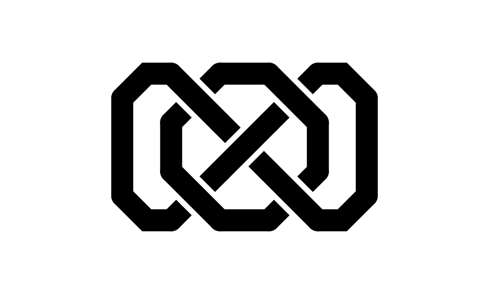
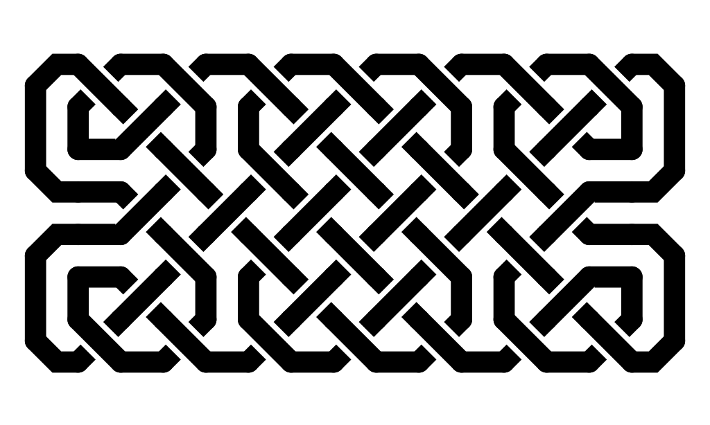
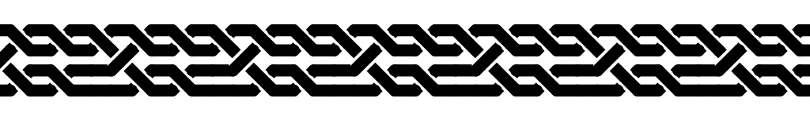

Celtic Knots
============

A quick utility for rendering celtic knots.  Usage is mostly explained by the `--help` flags, or a brief browse of the code.  Check out the samples too.

Sample images
-------------
These are all hand designed.

Example input file
------------------
These can be seen in the sample folder.  Here is the input file for the first image above
~~~
2 2
xx
xx
x-x
|x|
x-x
~~~

Procedural Braids
-----------------
Long, thin knots (useful for borders etc) can be generated with the `generate_braid` program.  Here are some samples of various sizes.

How to Use
----------
Usage is very simple, but to get started try running
~~~
python celtic samples/5x7.spec
~~~
and viewing `knot.png`.

For braids like the above, use (on linux/OSX)
~~~
./generate_braid | ./celtic
~~~
Use the `--help` flag for more options.
