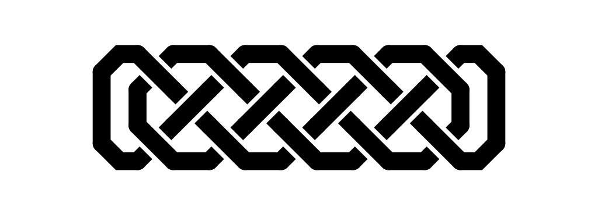

Celtic Knots
============

A quick utility for rendering celtic knots.  Usage is mostly explained by the `--help` flags, or a brief browse of the code.  Check out the samples too.

Sample images
-------------

Example input file
------------------
These can be seen in the sample folder.  Here is the input file for the first image above
~~~
2 2
xx
xx
x-x
|x|
x-x
~~~